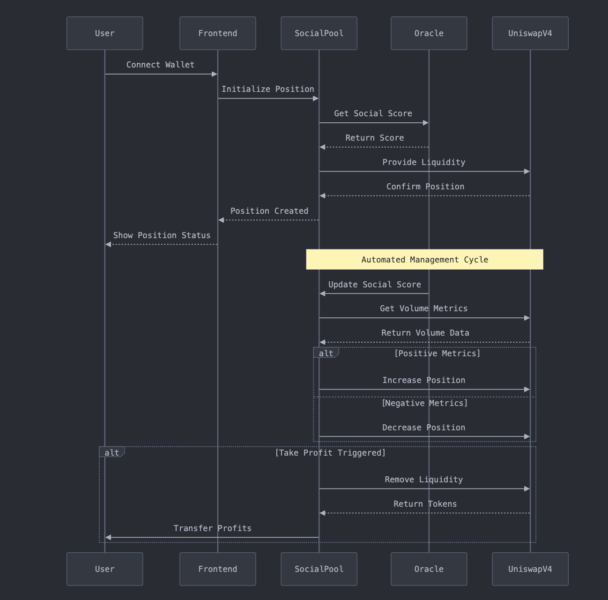
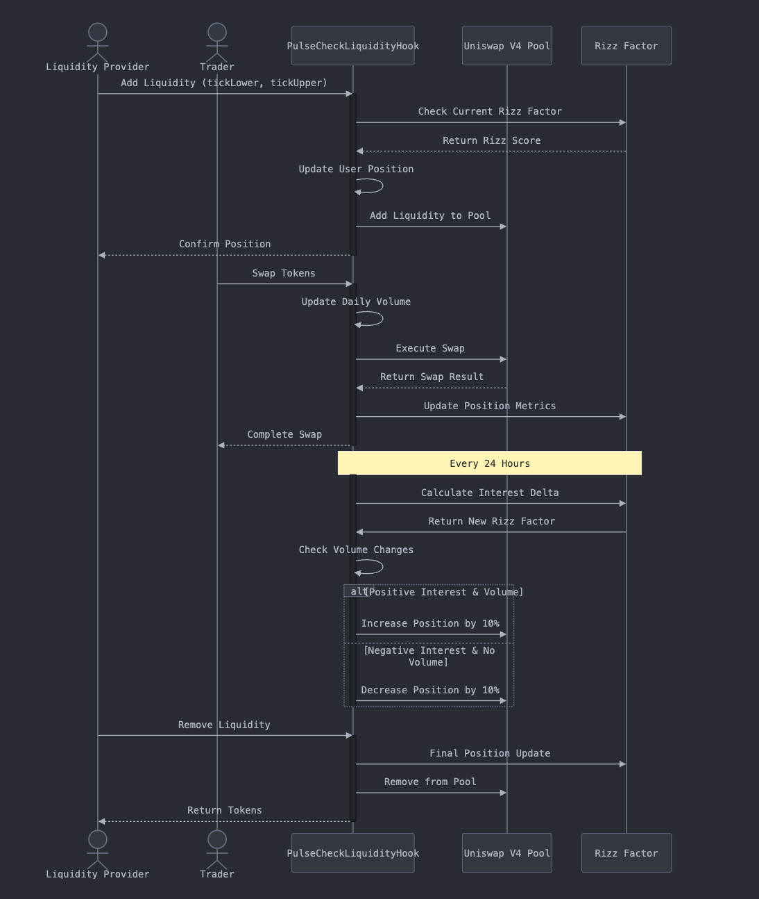

# Pulse Hook 🌊

Pulse Hook is a dynamic liquidity management built on Unichain that automatically adjusts liquidity positions based on trading volume and social sentiment(impressions) called Rizz Factor. The Rizz Factor is an offchain data about a person, place or a thing. The user provides the liquidity position and specify the time duration for which the LP to be locked in. The Hook monitors the trading volume and Rizz Factor for the specified time duration and if the conditions are met, the LP is adjusted accordingly to increase or decrease the liquidity and thereby improving the capital efficiency and generating higher fees. 

## Contract Address: 0xa32862E752C9133E61FDBEC795dF19b1C2Bf1840

## Unichain Sepolia Contract Explorer: https://unichain-sepolia.blockscout.com/address/0xa32862E752C9133E61FDBEC795dF19b1C2Bf1840

## Architecture 📐

## User Flow 🔄

## Features 🚀

- **Dynamic Liquidity Adjustment**: Automatically adjusts liquidity positions based on:
  - Daily trading volume
  - Time-based "Rizz Factor"
  - Pool activity metrics within specific price ranges (ticks)

- **Social Incentives**: 
  - Rewards active liquidity providers with increased positions
  - Penalizes inactive positions in low-volume periods
  - Daily "Rizz Factor" updates
  - Position tracking across price ranges (each tick represents a 0.01% price change)

- **Position Tracking**:
  - Detailed tracking of user LP positions with tick ranges
  - Volume monitoring per pool
  - Timestamp-based updates

## How It Works 🔄

### Price Ranges and Ticks
- In Uniswap v4, liquidity is provided within specific price ranges
- Each tick represents a 0.01% price change
- Users specify their position's tick range (e.g., -60 to +60 ticks = approximately ±0.6% price range)
- Smaller tick ranges concentrate liquidity but may require more frequent rebalancing

### Rizz Factor System
- Fixed daily Rizz Factor (currently set to hardcoded value of 33)
- Positions are updated every 24 hours (this can be adjusted in the future)
- Rizz Factor is an indicator of the social activity of a liquidity provider
- Liquidity adjustments:
  - +10% if positive interest and increased volume
  - -10% if negative interest and no volume increase

### Hook Implementation
The hook implements the following Uniswap v4 callbacks:
- `beforeAddLiquidity`: Checks position updates before adding liquidity within specified tick ranges
- `beforeRemoveLiquidity`: Validates position changes before removing liquidity from tick ranges
- `beforeSwap`: Updates positions based on trading activity within relevant ticks
- `afterSwap`: Records volume data and updates Rizz Factor based on tick-range activity

Each interaction triggers position updates and volume tracking within the specified tick ranges.

## Contributing 🤝

Contributions are welcome! Please feel free to submit a Pull Request.

## Acknowledgments 🙏

- Built on Unichain with Uniswap v4
- Developed for the Unfold Hackathon