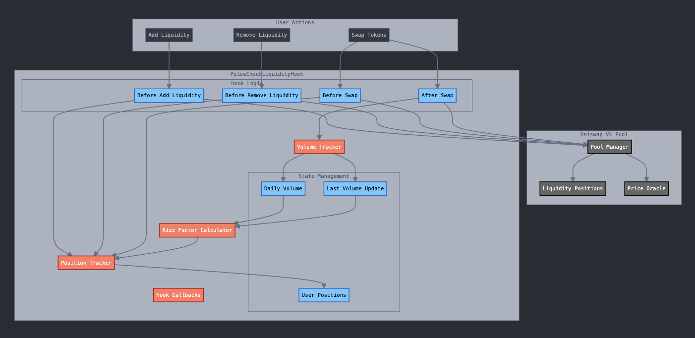

# Pulse Hook 🌊

Pulse Hook is a dynamic liquidity management built on Unichain that automatically adjusts liquidity positions based on trading volume and social sentiment(impressions) called Rizz Factor. The Rizz Factor is an offchain data about a person, place or a thing. The user provides the liquidity position and specify the time duration for which the LP to be locked in. The Hook monitors the trading volume and Rizz Factor for the specified time duration and if the conditions are met, the LP is adjusted accordingly to increase or decrease the liquidity and thereby improving the capital efficiency and generating higher fees. 

## Contract Address: 0xa32862E752C9133E61FDBEC795dF19b1C2Bf1840

## Unichain Sepolia Contract Explorer: https://unichain-sepolia.blockscout.com/address/0xa32862E752C9133E61FDBEC795dF19b1C2Bf1840

## Features 🚀

1. Liquidity Fragmentation: By incentivizing concentrated liquidity in active trading ranges, it helps solve the problem of scattered liquidity across different price ranges.

2. Passive Liquidity: Through the "Rizz Factor" and daily volume tracking, it encourages active liquidity management rather than passive "set and forget" positions.

3. Social Coordination: The social incentives create better coordination between liquidity providers, leading to more effective market making.

4. Capital Efficiency: By tracking trading activity and incentivizing active management, it helps LPs optimize their capital allocation and avoid having funds locked in inactive ranges.

Each of these problems is significant in DeFi, and the project provides innovative solutions through its hook mechanism and incentive structure.

### Hook Implementation
The hook implements the following Uniswap v4 callbacks:
- `beforeAddLiquidity`: Checks position updates before adding liquidity within specified tick ranges
- `beforeRemoveLiquidity`: Validates position changes before removing liquidity from tick ranges
- `beforeSwap`: Updates positions based on trading activity within relevant ticks
- `afterSwap`: Records volume data and updates Rizz Factor based on tick-range activity

Each interaction triggers position updates and volume tracking within the specified tick ranges.

## Uniswap Integration 🦄

PulseCheckLiquidityHook is specifically designed for Uniswap v4's hook system and aligns perfectly with the Unichain Developer Grants track by:

1. **Leveraging v4 Hooks**: 
   - Utilizes Uniswap v4's hook system to implement novel liquidity management strategies
   - Demonstrates the extensibility of v4's architecture through custom hook logic
   - Built natively for the UniChain ecosystem

2. **Enhancing UniChain's DeFi Infrastructure**:
   - Provides essential liquidity management tools for UniChain's growing DeFi ecosystem
   - Improves capital efficiency of Uniswap v4 pools on UniChain
   - Creates network effects through social coordination of liquidity providers

3. **Innovation in AMM Design**:
   - Introduces social coordination mechanisms to AMM liquidity provision
   - Implements novel incentive structures through the "Rizz Factor"
   - Demonstrates the potential of v4 hooks for creating more efficient markets

4. **Community Focus**:
   - Encourages active participation in UniChain's liquidity markets
   - Creates a collaborative environment for liquidity providers
   - Builds community around effective market making

## Architecture 📐

## User Flow 🔄

## Roadmap 🚀

## Contributing 🤝

Contributions are welcome! Please feel free to submit a Pull Request.

## Acknowledgments 🙏

- Built on Unichain with Uniswap v4
- Developed for the Unfold Hackathon